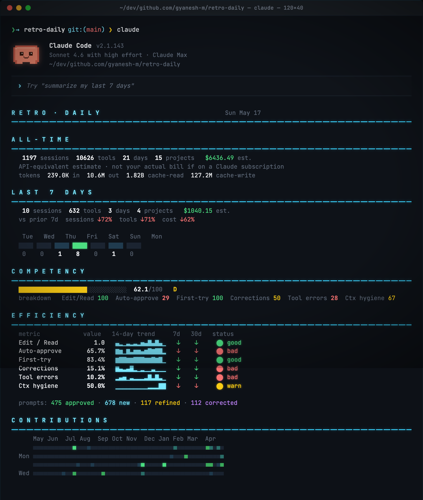
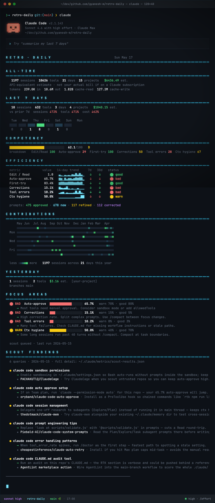
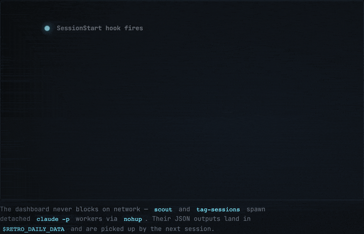
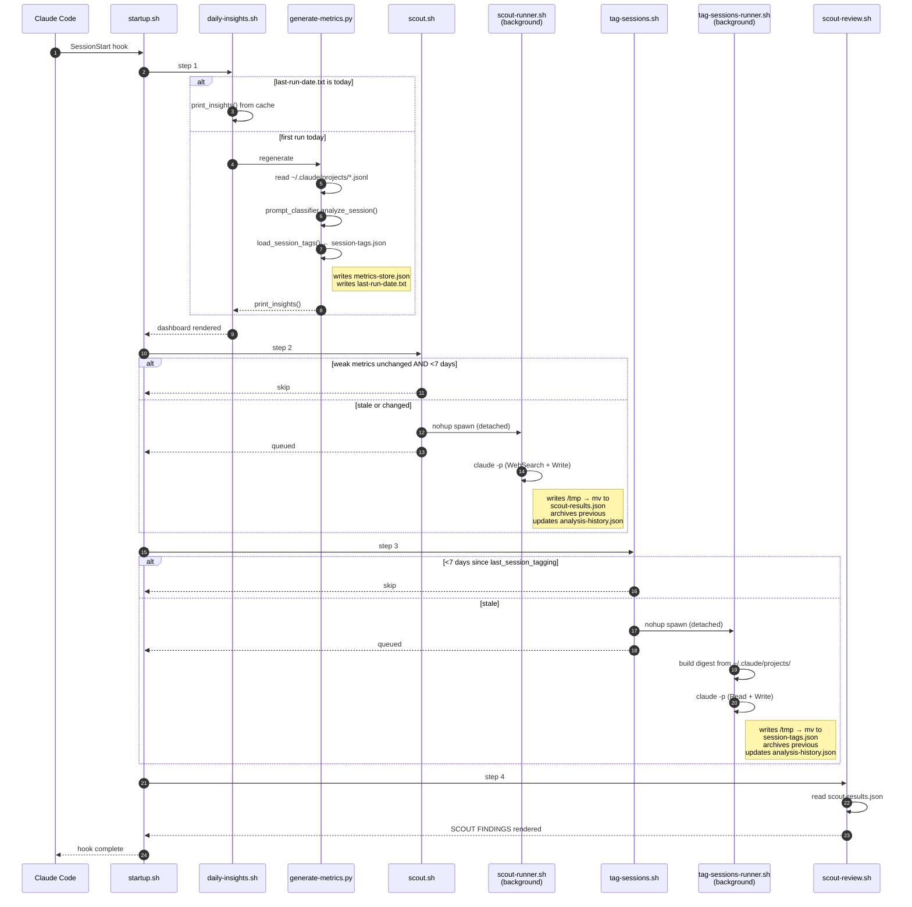
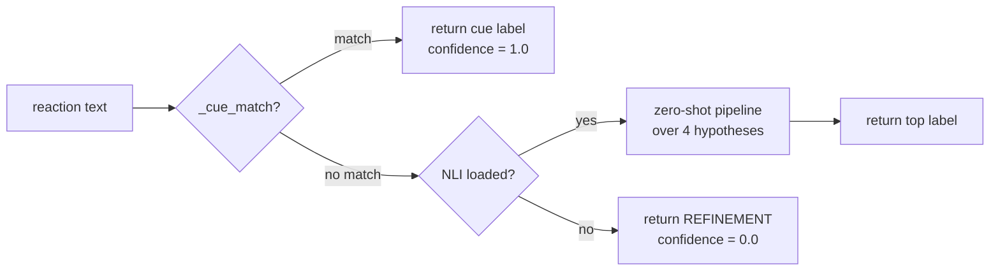

```
  d8888b. d88888b d888888b d8888b.  .d88b.
  88  `8D 88'     `~~88~~' 88  `8D .8P  Y8.
  88oobY' 88ooooo    88    88oobY' 88    88
  88`8b   88~~~~~    88    88`8b   88    88
  88 `88. 88.        88    88 `88. `8b  d8'
  88   YD Y88888P    YP    88   YD  `Y88P'

  d8888b.  .d8b.  d888888b db      db    db
  88  `8D d8' `8b   `88'   88      `8b  d8'
  88   88 88ooo88    88    88       `8bd8'
  88   88 88~~~88    88    88         88
  88  .8D 88   88   .88.   88booo.    88
  Y8888D' YP   YP Y888888P Y88888P    YP            [v0.1]

      ════════════════════════════════════════════
       a daily retro for your claude code sessions
```

A daily dashboard for your Claude Code sessions. Renders at the top of every session via a `SessionStart` hook — sessions, tools, cost, competency grade, efficiency trends, contributions heatmap, and a self-updating "scout" that searches docs and GitHub for ideas tied to your weakest metrics.



## Sample output

> The numbers below are sample data drawn from the author's own session history — your dashboard renders from your local `~/.claude/projects/*.jsonl`.



<details>
<summary>Plain-text version</summary>

```
R E T R O  ·  D A I L Y                                   Sun May 17
━━━━━━━━━━━━━━━━━━━━━━━━━━━━━━━━━━━━━━━━━━━━━━━━━━━━━━━━━━━━━━━━━━━━

A L L - T I M E
━━━━━━━━━━━━━━━━━━━━━━━━━━━━━━━━━━━━━━━━━━━━━━━━━━━━━━━━━━━━━━━━━━━━
   1197 sessions  10626 tools   21 days   15 projects   $6436.49 est.
  tokens  239.0K in  10.6M out  1.82B cache-read  127.2M cache-write

C O M P E T E N C Y
━━━━━━━━━━━━━━━━━━━━━━━━━━━━━━━━━━━━━━━━━━━━━━━━━━━━━━━━━━━━━━━━━━━━
  ███████████████████░░░░░░░░░░░   62.1/100    D
  breakdown   Edit/Read 100  Auto-approve 29  First-try 100  ...

E F F I C I E N C Y
━━━━━━━━━━━━━━━━━━━━━━━━━━━━━━━━━━━━━━━━━━━━━━━━━━━━━━━━━━━━━━━━━━━━
  metric            value   14-day trend     7d   30d   status
  Edit / Read         1.0   ▄▂▁▃▂▃▂▅▄█▄█▄▁   ↓    ↓     ⬤ good
  Auto-approve      65.7%   ▇▆▁▇▃▆▆▄▆█▇██▂   ↓    ↓     ⬤ bad
  First-try         83.4%   ▇██▇▇███▇▇█▇█▁   ↓    ↓     ⬤ good
  Corrections       15.1%   ▇▄▃▄█▂▁▂▁▁▃▁▁▁   ↓    ↓     ⬤ bad
  Tool errors       10.2%   ▂▄▅▁▃▂▂▂▃█▃█▃▁   ↓    ↓     ⬤ bad
  Ctx hygiene       50.0%   ·········▁▁▁██   ↓    ↓     ⬤ warn

C O N T R I B U T I O N S
━━━━━━━━━━━━━━━━━━━━━━━━━━━━━━━━━━━━━━━━━━━━━━━━━━━━━━━━━━━━━━━━━━━━
      May Jun  Jul Aug  Sep Oct Nov  Dec Jan Feb Mar  Apr
     ■■■■■■■■■■■■■■■■■■■■■■■■■■■■■■■■■■■■■■■■■■■■■■■■■■■■
  Mon ■■■■■■■■■■■■■■■■■■■■■■■■■■■■■■■■■■■■■■■■■■■■■■■■■■■■
  ...
  less ■■■■■ more   1197 sessions across 21 days this year

S C O U T   F I N D I N G S
━━━━━━━━━━━━━━━━━━━━━━━━━━━━━━━━━━━━━━━━━━━━━━━━━━━━━━━━━━━━━━━━━━━━
  ● claude code auto approve setup
      → If on Team plan, run `claude --permission-mode auto` ...
      ★ oryband/claude-code-auto-approve · Install as a PreToolUse hook ...
```

</details>

## Install

> Pick **one** of the two methods. Running both registers the hook twice.

### Option A — Claude Code plugin (recommended)

Inside Claude Code:

```
/plugin marketplace add gyanesh-m/retro-daily
/plugin install retro-daily@retro-daily
/reload-plugins
```

The repo doubles as its own single-plugin marketplace. State lives under `${CLAUDE_PLUGIN_DATA}` (`~/.claude/plugins/data/retro-daily-retro-daily/`) so plugin updates and uninstalls clean up after themselves.

Test against a local clone before publishing:

```sh
claude --plugin-dir ./retro-daily
```

### Option B — standalone script

```sh
git clone https://github.com/gyanesh-m/retro-daily.git
cd retro-daily && ./install.sh
```

Copies scripts to `~/.claude/metrics/`, marks them executable, and merges a `SessionStart` hook into `~/.claude/settings.json` via `jq` (idempotent; falls back to printing the JSON to paste manually if `jq` is missing).

Open a new Claude Code session — the dashboard renders.

## Paths

The scripts resolve their layout from two env vars. Defaults preserve the legacy single-directory layout for standalone installs; the plugin's `hooks.json` overrides both for plugin installs.

| Env var | Standalone default | Plugin default |
|---|---|---|
| `RETRO_DAILY_HOME` | script's own directory | `${CLAUDE_PLUGIN_ROOT}` |
| `RETRO_DAILY_DATA` | `~/.claude/metrics` | `${CLAUDE_PLUGIN_DATA}` |
| `RETRO_DAILY_PLAN_LABEL` | unset → generic footer | unset → generic footer |

Set `RETRO_DAILY_PLAN_LABEL="Claude Max $100/mo"` (or `"Claude Pro $20/mo"`, `"API"`, etc.) if you want the cost footer to name your plan. Claude Code does not expose the active subscription tier programmatically, so this can't be auto-detected.

## Requirements

- `python3` (3.9+) — required
- `claude` CLI on `$PATH` — required for the scout background worker
- `jq` — only for the standalone installer's `settings.json` merge

### Python dependencies

The prompt classifier uses `sentence-transformers` (~90MB MiniLM, required for topic similarity) and optionally `transformers` + `sentencepiece` (~500MB DeBERTa NLI, fallback for reactions that don't match any lexical cue). On the synthetic eval, lexical cues alone classify 49/50 cases correctly — NLI is insurance, not the primary path.

These are installed into a venv at `${RETRO_DAILY_DATA}/.venv` so they don't pollute system Python.

**Standalone install** runs `setup-venv.sh` automatically — first run downloads ~600MB of model deps.

**Plugin install** does not auto-bootstrap (plugin install paths are read-only at install time). After `/plugin install`, run once:

```sh
bash ~/.claude/plugins/cache/<marketplace>/<plugin>/setup-venv.sh
```

Or, simpler — clone and run:

```sh
git clone https://github.com/gyanesh-m/retro-daily.git
RETRO_DAILY_DATA=~/.claude/plugins/data/retro-daily-retro-daily \
  bash ./retro-daily/setup-venv.sh
```

The dashboard renders even without the venv — only the embedding-driven prompt outcome classification (APPROVAL / REFINEMENT / CORRECTION) is skipped.

## How classification works

| Signal | Source | Cadence |
|---|---|---|
| Prompt outcome (APPROVAL / REFINEMENT / CORRECTION / NEW_TASK) | `prompt_classifier.py` — lexical cues + zero-shot NLI fallback | Every regen (once per day) |
| Topic + interaction type per session | `tag-sessions-runner.sh` — `claude -p` labels each session with a free-form noun phrase | Once per week |
| Extractive summary of representative messages | `session_enricher.py` — longest-unique heuristic | Every regen |

The prompt classifier hits 98% on `tests/eval.json` (a 50-pair synthetic dataset). Run `python3 tests/eval_classifier.py` to verify against your own labels.

Session tags are surfaced as the `topics` and `interaction_types` fields per day in `metrics-store.json`. Untagged sessions (newly created since the last weekly run) show as `untagged` until the next tagging cycle.

## How it works

Every new Claude Code session fires the `SessionStart` hook, which calls `startup.sh`. That script runs four steps sequentially; two of them (`scout`, `tag-sessions`) spawn detached `claude -p` background workers and return immediately, so the rest of the dashboard renders without waiting on network or LLM calls.





The prompt classifier inside `generate-metrics.py` (call site at `analyze_session`) routes each reaction through a hybrid path. Lexical cues handle ~98% of the synthetic eval cases for free; NLI is a fallback for unusual phrasings, and is itself optional — if `transformers` isn't installed, unmatched reactions default to `REFINEMENT`.



### State files under `$RETRO_DAILY_DATA/`

Default `$RETRO_DAILY_DATA` is `~/.claude/metrics` (standalone install) or `${CLAUDE_PLUGIN_DATA}` (plugin install).

| File | Writer | Cadence | Purpose |
|---|---|---|---|
| `metrics-store.json` | `generate-metrics.py` | daily | append-only daily aggregates + cumulative roll-up |
| `last-run-date.txt` | `generate-metrics.py` | daily | gate so the expensive regen runs at most once per day |
| `scout-results.json` | `scout-runner.sh` | ≥7 days | latest scout findings rendered by `scout-review.sh` |
| `scout-archive/*.json` | `scout-runner.sh` | ≥7 days | timestamped snapshots of prior scouts (read by `scout-browse.sh`) |
| `session-tags.json` | `tag-sessions-runner.sh` | 7 days | LLM-derived `{id → topic, interaction_type}` map joined into daily metrics |
| `session-tags-archive/*.json` | `tag-sessions-runner.sh` | 7 days | timestamped snapshots of prior tag runs |
| `analysis-history.json` | both runners | per run | last-run dates + last weak-metric set; gates the two runners |
| `.scout.lock` / `.tag-sessions.lock` | runners | transient | PID files preventing double-spawn |
| `.venv/` | `setup-venv.sh` | install | isolated Python env for `sentence-transformers` and optional NLI |

**Cadence implication.** Tag results lag by up to 7 days. A session created today won't have a topic in the dashboard until the next weekly tagging run — it'll show up under `topics: untagged` in `metrics-store.json` and the corresponding dashboard line. Force an immediate run with `TAG_FORCE=1 bash tag-sessions.sh` if you want to backfill.

## Files

| File | Role |
|---|---|
| `startup.sh` | hook entrypoint, runs the steps below |
| `daily-insights.sh` + `generate-metrics.py` + `metric_advisor.py` | dashboard renderer |
| `prompt_classifier.py` | hybrid cue + zero-shot NLI prompt classifier |
| `session_enricher.py` | session tag loader + extractive summary |
| `scout.sh` + `scout-runner.sh` + `scout-review.sh` + `scout-browse.sh` | background scout worker for weak-metric guidance |
| `tag-sessions.sh` + `tag-sessions-runner.sh` | weekly LLM session tagger |
| `tests/eval.json` + `tests/eval_classifier.py` + `tests/sample_pairs.py` | classifier regression test |
| `_paths.sh` | shared `RETRO_DAILY_HOME` / `RETRO_DAILY_DATA` resolution |
| `install.sh` + `setup-venv.sh` + `requirements.txt` | standalone installer + Python venv bootstrap |
| `.claude-plugin/plugin.json` + `.claude-plugin/marketplace.json` + `hooks/hooks.json` | plugin packaging |

## Uninstall

**Plugin install:**

```
/plugin uninstall retro-daily@retro-daily
```

This also clears `~/.claude/plugins/data/retro-daily-retro-daily/`. Pass `--keep-data` to preserve the metrics store across reinstalls.

**Standalone install:**

```sh
rm -rf ~/.claude/metrics
```

Then remove the `SessionStart` hook entry from `~/.claude/settings.json`.

```
                  [ press any key to continue ]
```

---

<sub>"Claude" and "Claude Code" are trademarks of Anthropic, PBC. This project is not affiliated with, endorsed by, or sponsored by Anthropic.</sub>
