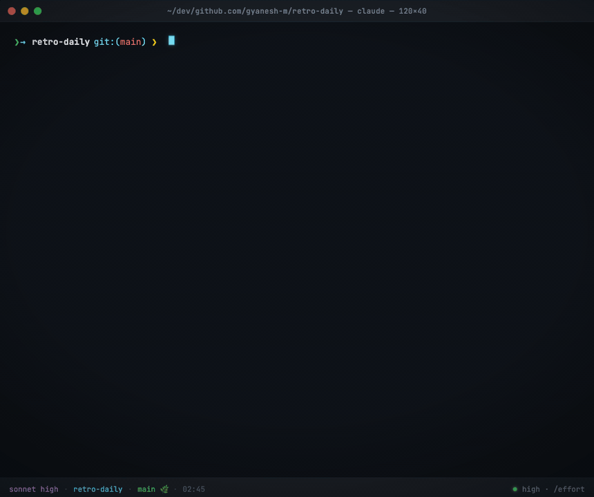

# Retro Daily

> A daily retro for your Claude Code sessions

[](LICENSE) [](https://claude.com/code) [](https://gyanesh-m.github.io/retro-daily/) [](https://github.com/gyanesh-m/retro-daily/pulls)



Renders at the top of every Claude Code session via a `SessionStart` hook:

- **All-time + last-7-days totals** — sessions, tools, days, cost (API-equivalent)
- **Competency grade** — 0–100 composite score plus an A–F letter, with per-metric breakdown
- **14-day efficiency sparklines** for Edit/Read, auto-approve, first-try, corrections, tool errors, context hygiene
- **Year-long contributions heatmap** — the green-grid you know from GitHub, sourced from your session history
- **Focus areas** — concrete, actionable recommendations for your weakest metrics
- **Scout findings** — a background worker that searches docs.anthropic.com and GitHub for ideas tied to those weak metrics

<details>
<summary>Plain-text preview</summary>

```
R E T R O  ·  D A I L Y                                   Sun May 17
━━━━━━━━━━━━━━━━━━━━━━━━━━━━━━━━━━━━━━━━━━━━━━━━━━━━━━━━━━━━━━━━━━━━

A L L - T I M E
━━━━━━━━━━━━━━━━━━━━━━━━━━━━━━━━━━━━━━━━━━━━━━━━━━━━━━━━━━━━━━━━━━━━
   1197 sessions  10626 tools   21 days   15 projects   $6436.49 est.
  tokens  239.0K in  10.6M out  1.82B cache-read  127.2M cache-write

C O M P E T E N C Y
━━━━━━━━━━━━━━━━━━━━━━━━━━━━━━━━━━━━━━━━━━━━━━━━━━━━━━━━━━━━━━━━━━━━
  ███████████████████░░░░░░░░░░░   62.1/100    D
  breakdown   Edit/Read 100  Auto-approve 29  First-try 100  ...

E F F I C I E N C Y
━━━━━━━━━━━━━━━━━━━━━━━━━━━━━━━━━━━━━━━━━━━━━━━━━━━━━━━━━━━━━━━━━━━━
  metric            value   14-day trend     7d   30d   status
  Edit / Read         1.0   ▄▂▁▃▂▃▂▅▄█▄█▄▁   →    ↑     ⬤ good
  Auto-approve      65.7%   ▇▆▁▇▃▆▆▄▆█▇██▂   ↑    →     ⬤ bad
  First-try         83.4%   ▇██▇▇███▇▇█▇█▁   ↑    ↑     ⬤ good
  Corrections       15.1%   ▇▄▃▄█▂▁▂▁▁▃▁▁▁   ↓    ↓     ⬤ bad
  Tool errors       10.2%   ▂▄▅▁▃▂▂▂▃█▃█▃▁   →    ↓     ⬤ bad
  Ctx hygiene       50.0%   ·········▁▁▁██   ↑    →     ⬤ warn

C O N T R I B U T I O N S
━━━━━━━━━━━━━━━━━━━━━━━━━━━━━━━━━━━━━━━━━━━━━━━━━━━━━━━━━━━━━━━━━━━━
      May Jun  Jul Aug  Sep Oct Nov  Dec Jan Feb Mar  Apr
     ■■■■■■■■■■■■■■■■■■■■■■■■■■■■■■■■■■■■■■■■■■■■■■■■■■■■
  Mon ■■■■■■■■■■■■■■■■■■■■■■■■■■■■■■■■■■■■■■■■■■■■■■■■■■■■
  ...
  less ■■■■■ more   1197 sessions across 21 days this year

S C O U T   F I N D I N G S
━━━━━━━━━━━━━━━━━━━━━━━━━━━━━━━━━━━━━━━━━━━━━━━━━━━━━━━━━━━━━━━━━━━━
  ● claude code auto approve setup
      → If on Team plan, run `claude --permission-mode auto` ...
      ★ oryband/claude-code-auto-approve · Install as a PreToolUse hook ...
```

</details>

## Install

Inside Claude Code:

```
/plugin marketplace add gyanesh-m/retro-daily
/plugin install retro-daily@retro-daily
/reload-plugins
```

The repo doubles as its own single-plugin marketplace. State lives under `${CLAUDE_PLUGIN_DATA}` (`~/.claude/plugins/data/retro-daily-retro-daily/`) so plugin updates and uninstalls clean up after themselves.

Test against a local clone before publishing:

```sh
claude --plugin-dir ./retro-daily
```

## Configuration

The scripts read the following env vars at session start. The plugin's `hooks.json` sets path-related ones automatically.

### Paths and labels

| Env var | Default |
|---|---|
| `RETRO_DAILY_HOME` | `${CLAUDE_PLUGIN_ROOT}` |
| `RETRO_DAILY_DATA` | `${CLAUDE_PLUGIN_DATA}` (`~/.claude/plugins/data/retro-daily-retro-daily/`) |
| `RETRO_DAILY_PLAN_LABEL` | unset → generic footer |

Set `RETRO_DAILY_PLAN_LABEL="Claude Max $100/mo"` (or `"Claude Pro $20/mo"`, `"API"`, etc.) if you want the cost footer to name your plan. Claude Code does not expose the active subscription tier programmatically, so this can't be auto-detected.

### Background scout (network-facing)

The scout spawns a detached, sandboxed `claude -p` worker that uses `WebSearch` (network access to `docs.anthropic.com` and `github.com`) to research your weakest metrics. Two knobs control it:

| Env var | Default | Effect |
|---|---|---|
| `RETRO_DAILY_NO_BACKGROUND_WORKERS` | `0` | Set to `1` to fully opt out of the scout + tag-sessions background workers. The dashboard still renders; just no network-facing research. |
| `SCOUT_STALE_DAYS` | `7` | Minimum days between scout runs when weak metrics haven't changed. Raise to throttle further. |

Put either in your shell rc, or in your project's `.envrc` if you use direnv. The scout is also automatically skipped if a previous worker is still running, or if its weak-metric set matches the last successful run.

## Requirements

- `python3` (3.9+) — required
- `claude` CLI on `$PATH` — required for the scout background worker

### Python dependencies

The prompt classifier uses `sentence-transformers` (~90MB MiniLM, required for topic similarity) and optionally `transformers` + `sentencepiece` (~500MB DeBERTa NLI, fallback for reactions that don't match any lexical cue). On the synthetic eval, lexical cues alone classify 49/50 cases correctly — NLI is insurance, not the primary path.

These are installed into a venv at `${RETRO_DAILY_DATA}/.venv` so they don't pollute system Python. Plugin install paths are read-only at install time, so the venv isn't auto-bootstrapped. After `/plugin install`, run once:

```sh
bash ~/.claude/plugins/cache/<marketplace>/<plugin>/setup-venv.sh
```

Or, simpler — clone and run:

```sh
git clone https://github.com/gyanesh-m/retro-daily.git
RETRO_DAILY_DATA=~/.claude/plugins/data/retro-daily-retro-daily \
  bash ./retro-daily/setup-venv.sh
```

First run downloads ~600MB of model deps. The dashboard renders even without the venv — only the embedding-driven prompt outcome classification (APPROVAL / REFINEMENT / CORRECTION) is skipped.

## How classification works

| Signal | Source | Cadence |
|---|---|---|
| Prompt outcome (APPROVAL / REFINEMENT / CORRECTION / NEW_TASK) | `prompt_classifier.py` — lexical cues + zero-shot NLI fallback | Every regen (once per day) |
| Topic + interaction type per session | `tag-sessions-runner.sh` — `claude -p` labels each session with a free-form noun phrase | Once per week |
| Extractive summary of representative messages | `session_enricher.py` — longest-unique heuristic | Every regen |

The prompt classifier hits 98% on `tests/eval.json` (a 50-pair synthetic dataset). Run `python3 tests/eval_classifier.py` to verify against your own labels.

Session tags are surfaced as the `topics` and `interaction_types` fields per day in `metrics-store.json`. Untagged sessions (newly created since the last weekly run) show as `untagged` until the next tagging cycle.

## How it works

Every new Claude Code session fires the `SessionStart` hook, which calls `startup.sh`. That script runs four steps sequentially; two of them (`scout`, `tag-sessions`) spawn detached `claude -p` background workers and return immediately, so the rest of the dashboard renders without waiting on network or LLM calls.


Full sequence diagram, state-file inventory, and the OS-level sandbox the background workers run under: **[docs/internals.md](docs/internals.md)**.

## Files

| File | Role |
|---|---|
| `startup.sh` | hook entrypoint, runs the steps below |
| `daily-insights.sh` + `generate-metrics.py` + `metric_advisor.py` | dashboard renderer |
| `prompt_classifier.py` | hybrid cue + zero-shot NLI prompt classifier |
| `session_enricher.py` | session tag loader + extractive summary |
| `scout.sh` + `scout-runner.sh` + `scout-review.sh` + `scout-browse.sh` | background scout worker for weak-metric guidance |
| `tag-sessions.sh` + `tag-sessions-runner.sh` | weekly LLM session tagger |
| `tests/eval.json` + `tests/eval_classifier.py` + `tests/sample_pairs.py` | classifier regression test |
| `_paths.sh` | shared `RETRO_DAILY_HOME` / `RETRO_DAILY_DATA` resolution |
| `setup-venv.sh` + `requirements.txt` | Python venv bootstrap |
| `.claude-plugin/plugin.json` + `.claude-plugin/marketplace.json` + `hooks/hooks.json` | plugin packaging |
| `LICENSE` | MIT, applies to all repo content |
| `docs/internals.md` + `docs/troubleshooting.md` | extended docs split out of the README |
| `docs/index.html` + `docs/app.js` + `docs/style.css` + `docs/screenshots/*` | GitHub Pages landing page (animated CRT demo) |

## Uninstall

**Plugin install:**

```
/plugin uninstall retro-daily@retro-daily
```

This also clears `~/.claude/plugins/data/retro-daily-retro-daily/`. Pass `--keep-data` to preserve the metrics store across reinstalls.

## Compatibility notes

**Claude Code v2.1.x** changed how `SessionStart` hook output reaches the user. Per the [hooks docs](https://code.claude.com/docs/en/hooks):

| Output channel | What the user sees in their terminal | What the LLM sees in context |
|---|---|---|
| Plain stdout from the hook | nothing visible (v2.1.x routes it into `additionalContext`) | the full output as system context |
| `hookSpecificOutput.additionalContext` (JSON) | nothing visible | adds to system context |
| `systemMessage` (JSON) | rendered inline at the top of the session | nothing |

retro-daily's `startup.sh` emits a JSON document with **both** `systemMessage` (so you see the dashboard rendered in your terminal) and `hookSpecificOutput.additionalContext` (so Claude can answer questions about your stats). On v2.0.x and earlier (line-by-line output, no full-screen TUI), plain stdout would have rendered directly — the JSON envelope works on both.

If you don't see the dashboard at the top of a fresh session: `tail /tmp/claude-startup.log` to confirm the hook ran and the dashboard was generated, then read [docs/troubleshooting.md](docs/troubleshooting.md).

## Troubleshooting

Symptoms and fixes — empty dashboard on v2.1.x, scout stuck at `queued · last run never`, sandbox unavailable: **[docs/troubleshooting.md](docs/troubleshooting.md)**.

---

<sub>"Claude" and "Claude Code" are trademarks of Anthropic, PBC. This project is not affiliated with, endorsed by, or sponsored by Anthropic.</sub>
