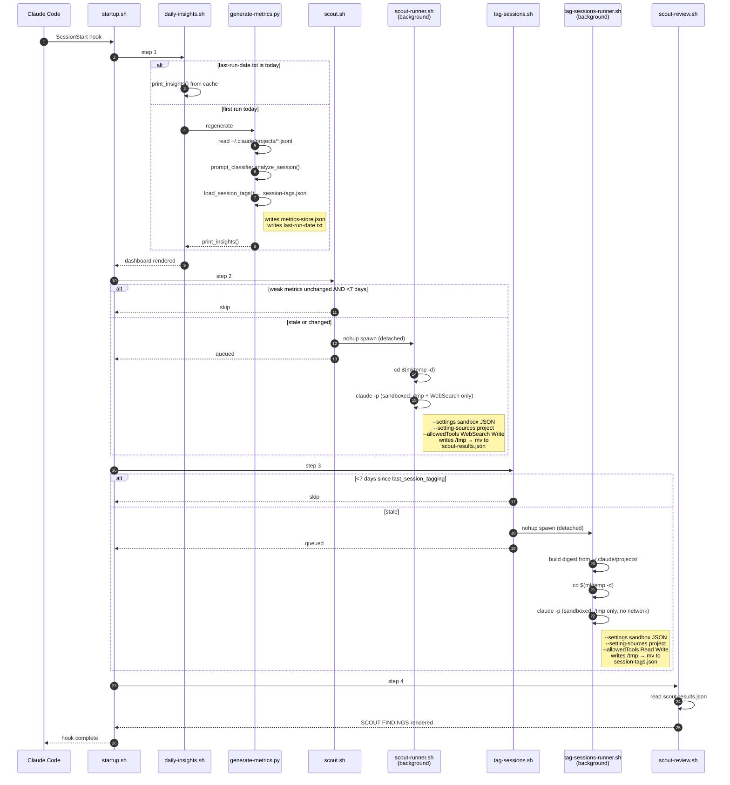
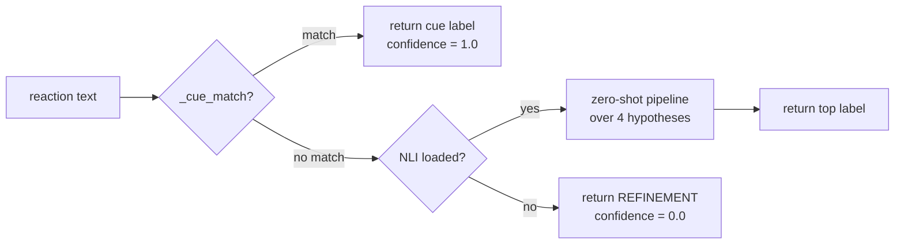

# Retro Daily

> A daily retro for your Claude Code sessions

[](LICENSE) [](https://claude.com/code) [](https://gyanesh-m.github.io/retro-daily/) [](https://github.com/gyanesh-m/retro-daily/pulls)


Renders at the top of every Claude Code session via a `SessionStart` hook:

- **All-time + last-7-days totals** — sessions, tools, days, cost (API-equivalent)
- **Competency grade** — 0–100 composite score plus an A–F letter, with per-metric breakdown
- **14-day efficiency sparklines** for Edit/Read, auto-approve, first-try, corrections, tool errors, context hygiene
- **Year-long contributions heatmap** — the green-grid you know from GitHub, sourced from your session history
- **Focus areas** — concrete, actionable recommendations for your weakest metrics
- **Scout findings** — a background worker that searches docs.anthropic.com and GitHub for ideas tied to those weak metrics

## Sample output

> The numbers below are sample data drawn from the author's own session history — your dashboard renders from your local `~/.claude/projects/*.jsonl`.


<details>
<summary>Plain-text version</summary>

```
R E T R O  ·  D A I L Y                                   Sun May 17
━━━━━━━━━━━━━━━━━━━━━━━━━━━━━━━━━━━━━━━━━━━━━━━━━━━━━━━━━━━━━━━━━━━━

A L L - T I M E
━━━━━━━━━━━━━━━━━━━━━━━━━━━━━━━━━━━━━━━━━━━━━━━━━━━━━━━━━━━━━━━━━━━━
   1197 sessions  10626 tools   21 days   15 projects   $6436.49 est.
  tokens  239.0K in  10.6M out  1.82B cache-read  127.2M cache-write

C O M P E T E N C Y
━━━━━━━━━━━━━━━━━━━━━━━━━━━━━━━━━━━━━━━━━━━━━━━━━━━━━━━━━━━━━━━━━━━━
  ███████████████████░░░░░░░░░░░   62.1/100    D
  breakdown   Edit/Read 100  Auto-approve 29  First-try 100  ...

E F F I C I E N C Y
━━━━━━━━━━━━━━━━━━━━━━━━━━━━━━━━━━━━━━━━━━━━━━━━━━━━━━━━━━━━━━━━━━━━
  metric            value   14-day trend     7d   30d   status
  Edit / Read         1.0   ▄▂▁▃▂▃▂▅▄█▄█▄▁   →    ↑     ⬤ good
  Auto-approve      65.7%   ▇▆▁▇▃▆▆▄▆█▇██▂   ↑    →     ⬤ bad
  First-try         83.4%   ▇██▇▇███▇▇█▇█▁   ↑    ↑     ⬤ good
  Corrections       15.1%   ▇▄▃▄█▂▁▂▁▁▃▁▁▁   ↓    ↓     ⬤ bad
  Tool errors       10.2%   ▂▄▅▁▃▂▂▂▃█▃█▃▁   →    ↓     ⬤ bad
  Ctx hygiene       50.0%   ·········▁▁▁██   ↑    →     ⬤ warn

C O N T R I B U T I O N S
━━━━━━━━━━━━━━━━━━━━━━━━━━━━━━━━━━━━━━━━━━━━━━━━━━━━━━━━━━━━━━━━━━━━
      May Jun  Jul Aug  Sep Oct Nov  Dec Jan Feb Mar  Apr
     ■■■■■■■■■■■■■■■■■■■■■■■■■■■■■■■■■■■■■■■■■■■■■■■■■■■■
  Mon ■■■■■■■■■■■■■■■■■■■■■■■■■■■■■■■■■■■■■■■■■■■■■■■■■■■■
  ...
  less ■■■■■ more   1197 sessions across 21 days this year

S C O U T   F I N D I N G S
━━━━━━━━━━━━━━━━━━━━━━━━━━━━━━━━━━━━━━━━━━━━━━━━━━━━━━━━━━━━━━━━━━━━
  ● claude code auto approve setup
      → If on Team plan, run `claude --permission-mode auto` ...
      ★ oryband/claude-code-auto-approve · Install as a PreToolUse hook ...
```

</details>

## Install

> Pick **one** of the two methods. Running both registers the hook twice.

### Option A — Claude Code plugin (recommended)

Inside Claude Code:

```
/plugin marketplace add gyanesh-m/retro-daily
/plugin install retro-daily@retro-daily
/reload-plugins
```

The repo doubles as its own single-plugin marketplace. State lives under `${CLAUDE_PLUGIN_DATA}` (`~/.claude/plugins/data/retro-daily-retro-daily/`) so plugin updates and uninstalls clean up after themselves.

Test against a local clone before publishing:

```sh
claude --plugin-dir ./retro-daily
```

### Option B — standalone script

```sh
git clone https://github.com/gyanesh-m/retro-daily.git
cd retro-daily && ./install.sh
```

Copies scripts to `~/.claude/metrics/`, marks them executable, and merges a `SessionStart` hook into `~/.claude/settings.json` via `jq` (idempotent; falls back to printing the JSON to paste manually if `jq` is missing).

Open a new Claude Code session — the dashboard renders.

### Migrating from standalone to plugin

If you started with Option B and want to switch to Option A, both `SessionStart` hooks will fire (the one in `~/.claude/settings.json` *and* the plugin's own hook from `hooks/hooks.json`) until you remove the standalone entry. The dashboard renders twice, the metrics get written to two different data dirs, and on Claude Code v2.1.x the visible terminal output gets confused. To migrate cleanly:

```sh
# 1. Back up the standalone scripts + data
BACKUP="$HOME/.claude/metrics-backup-$(date +%Y%m%d-%H%M%S)"
mkdir -p "$BACKUP"
cd "$HOME/.claude/metrics"
for f in startup.sh daily-insights.sh scout.sh scout-runner.sh \
         scout-review.sh scout-browse.sh tag-sessions.sh \
         tag-sessions-runner.sh setup-venv.sh _paths.sh \
         generate-metrics.py prompt_classifier.py metric_advisor.py \
         session_enricher.py requirements.txt \
         metrics-store.json analysis-history.json last-run-date.txt \
         scout-queries.json scout-results.json session-tags.json \
         scout.log tag-sessions.log; do
  [ -e "$f" ] && mv "$f" "$BACKUP/"
done
for d in scout-archive session-tags-archive; do
  [ -d "$d" ] && mv "$d" "$BACKUP/"
done

# 2. Remove the standalone SessionStart hook from settings.json
jq '.hooks.SessionStart[0].hooks |= map(select(.command | contains("metrics/startup.sh") | not))' \
   ~/.claude/settings.json > /tmp/settings.new && mv /tmp/settings.new ~/.claude/settings.json
```

The plugin's data dir (`~/.claude/plugins/data/retro-daily-retro-daily/`) regenerates from your `~/.claude/projects/*.jsonl` on the next session — no manual data migration needed.

## Paths

The scripts resolve their layout from two env vars. Defaults preserve the legacy single-directory layout for standalone installs; the plugin's `hooks.json` overrides both for plugin installs.

| Env var | Standalone default | Plugin default |
|---|---|---|
| `RETRO_DAILY_HOME` | script's own directory | `${CLAUDE_PLUGIN_ROOT}` |
| `RETRO_DAILY_DATA` | `~/.claude/metrics` | `${CLAUDE_PLUGIN_DATA}` |
| `RETRO_DAILY_PLAN_LABEL` | unset → generic footer | unset → generic footer |

Set `RETRO_DAILY_PLAN_LABEL="Claude Max $100/mo"` (or `"Claude Pro $20/mo"`, `"API"`, etc.) if you want the cost footer to name your plan. Claude Code does not expose the active subscription tier programmatically, so this can't be auto-detected.

## Requirements

- `python3` (3.9+) — required
- `claude` CLI on `$PATH` — required for the scout background worker
- `jq` — only for the standalone installer's `settings.json` merge

### Python dependencies

The prompt classifier uses `sentence-transformers` (~90MB MiniLM, required for topic similarity) and optionally `transformers` + `sentencepiece` (~500MB DeBERTa NLI, fallback for reactions that don't match any lexical cue). On the synthetic eval, lexical cues alone classify 49/50 cases correctly — NLI is insurance, not the primary path.

These are installed into a venv at `${RETRO_DAILY_DATA}/.venv` so they don't pollute system Python.

**Standalone install** runs `setup-venv.sh` automatically — first run downloads ~600MB of model deps.

**Plugin install** does not auto-bootstrap (plugin install paths are read-only at install time). After `/plugin install`, run once:

```sh
bash ~/.claude/plugins/cache/<marketplace>/<plugin>/setup-venv.sh
```

Or, simpler — clone and run:

```sh
git clone https://github.com/gyanesh-m/retro-daily.git
RETRO_DAILY_DATA=~/.claude/plugins/data/retro-daily-retro-daily \
  bash ./retro-daily/setup-venv.sh
```

The dashboard renders even without the venv — only the embedding-driven prompt outcome classification (APPROVAL / REFINEMENT / CORRECTION) is skipped.

## How classification works

| Signal | Source | Cadence |
|---|---|---|
| Prompt outcome (APPROVAL / REFINEMENT / CORRECTION / NEW_TASK) | `prompt_classifier.py` — lexical cues + zero-shot NLI fallback | Every regen (once per day) |
| Topic + interaction type per session | `tag-sessions-runner.sh` — `claude -p` labels each session with a free-form noun phrase | Once per week |
| Extractive summary of representative messages | `session_enricher.py` — longest-unique heuristic | Every regen |

The prompt classifier hits 98% on `tests/eval.json` (a 50-pair synthetic dataset). Run `python3 tests/eval_classifier.py` to verify against your own labels.

Session tags are surfaced as the `topics` and `interaction_types` fields per day in `metrics-store.json`. Untagged sessions (newly created since the last weekly run) show as `untagged` until the next tagging cycle.

## How it works

Every new Claude Code session fires the `SessionStart` hook, which calls `startup.sh`. That script runs four steps sequentially; two of them (`scout`, `tag-sessions`) spawn detached `claude -p` background workers and return immediately, so the rest of the dashboard renders without waiting on network or LLM calls.




The prompt classifier inside `generate-metrics.py` (call site at `analyze_session`) routes each reaction through a hybrid path. Lexical cues handle ~98% of the synthetic eval cases for free; NLI is a fallback for unusual phrasings, and is itself optional — if `transformers` isn't installed, unmatched reactions default to `REFINEMENT`.



### State files under `$RETRO_DAILY_DATA/`

Default `$RETRO_DAILY_DATA` is `~/.claude/metrics` (standalone install) or `${CLAUDE_PLUGIN_DATA}` (plugin install).

| File | Writer | Cadence | Purpose |
|---|---|---|---|
| `metrics-store.json` | `generate-metrics.py` | daily | append-only daily aggregates + cumulative roll-up |
| `last-run-date.txt` | `generate-metrics.py` | daily | gate so the expensive regen runs at most once per day |
| `scout-queries.json` | `generate-metrics.py` | per regen | weak-metric set + the 6 search queries scout-runner will execute; signal file that triggers `scout.sh` to spawn the background worker |
| `scout-results.json` | `scout-runner.sh` | ≥7 days | latest scout findings rendered by `scout-review.sh` |
| `scout-archive/YYYY-MM-DD-HHMMSS.json` | `scout-runner.sh` | ≥7 days | timestamped snapshots of prior scouts (read by `scout-browse.sh`) |
| `scout.log` | `scout-runner.sh` | per spawn | append-only worker log; `tail` this to debug stuck/failed scout runs |
| `session-tags.json` | `tag-sessions-runner.sh` | 7 days | LLM-derived `{id → topic, interaction_type}` map joined into daily metrics |
| `session-tags-archive/YYYY-MM-DD-HHMMSS.json` | `tag-sessions-runner.sh` | 7 days | timestamped snapshots of prior tag runs |
| `tag-sessions.log` | `tag-sessions-runner.sh` | per spawn | append-only worker log for the weekly tagger |
| `analysis-history.json` | both runners | per run | last-run dates + last weak-metric set; gates the two runners |
| `.scout.lock` / `.tag-sessions.lock` | runners | transient | PID files preventing double-spawn |
| `.venv/` | `setup-venv.sh` | install / update | isolated Python env for `sentence-transformers` and optional NLI |

**Cadence implication.** Tag results lag by up to 7 days. A session created today won't have a topic in the dashboard until the next weekly tagging run — it'll show up under `topics: untagged` in `metrics-store.json` and the corresponding dashboard line. Force an immediate run with `TAG_FORCE=1 bash tag-sessions.sh` if you want to backfill.

### Security model for background workers

Both `scout-runner.sh` and `tag-sessions-runner.sh` spawn `claude -p` to do real work (WebSearch / Read+Write to `/tmp`). Without intervention, third-party `PreToolUse` hooks installed at the user level — like [Sage](https://github.com/gendigitalinc/sage) — return `"ask"` against any unattended session and kill `claude -p` with `terminal_reason=hook_stopped` before any work happens.

Rather than bypass those hooks with `--dangerously-skip-permissions` (which would silently disable the user's chosen security tooling), the runners wrap each `claude -p` invocation in Claude Code's **OS-level sandbox** (`sandbox-exec` on macOS, `bubblewrap` on Linux). The sandbox config passed via `--settings`:

| Worker | Filesystem writes | Network |
|---|---|---|
| `scout-runner.sh` | `/tmp` only (denies `/Users`, `/etc`, `/usr`, `/var`, `/Library`, `/Applications`) | all domains allowed (WebSearch needs internet) |
| `tag-sessions-runner.sh` | `/tmp` only (same denylist) | all domains denied |

`failIfUnavailable: true` means if the OS sandbox can't be set up, the worker fails loudly rather than silently running unsandboxed. On supported systems, this is meaningfully safer than the alternative — even if a prompt-injected response tries to write to `~/.ssh/authorized_keys` or curl-pipe a shell, the kernel refuses.

**Why this works alongside Sage.** The sandbox is enforced by the OS at the syscall level, before any hook fires. Once `claude -p` is wrapped, Sage's `PreToolUse` either doesn't run (sandboxed sessions are exempt in some configurations) or runs but its verdict is moot — the sandbox is already the safety floor. Empirically, sandboxed scout runs complete cleanly with `terminal_reason=completed` and no hook interference.

**Opt out entirely.** If you'd rather not have retro-daily spawn unattended Claude sessions at all — even sandboxed — set `RETRO_DAILY_NO_BACKGROUND_WORKERS=1` in your environment. The dashboard still renders (totals, competency, efficiency, contributions heatmap, focus areas); only scout findings and session tags are skipped. You'll see `[scout] skipped — RETRO_DAILY_NO_BACKGROUND_WORKERS=1` in the hook output instead.

## Files

| File | Role |
|---|---|
| `startup.sh` | hook entrypoint, runs the steps below |
| `daily-insights.sh` + `generate-metrics.py` + `metric_advisor.py` | dashboard renderer |
| `prompt_classifier.py` | hybrid cue + zero-shot NLI prompt classifier |
| `session_enricher.py` | session tag loader + extractive summary |
| `scout.sh` + `scout-runner.sh` + `scout-review.sh` + `scout-browse.sh` | background scout worker for weak-metric guidance |
| `tag-sessions.sh` + `tag-sessions-runner.sh` | weekly LLM session tagger |
| `tests/eval.json` + `tests/eval_classifier.py` + `tests/sample_pairs.py` | classifier regression test |
| `_paths.sh` | shared `RETRO_DAILY_HOME` / `RETRO_DAILY_DATA` resolution |
| `install.sh` + `setup-venv.sh` + `requirements.txt` | standalone installer + Python venv bootstrap |
| `.claude-plugin/plugin.json` + `.claude-plugin/marketplace.json` + `hooks/hooks.json` | plugin packaging |
| `LICENSE` | MIT, applies to all repo content |
| `docs/index.html` + `docs/app.js` + `docs/style.css` + `docs/screenshots/*` | GitHub Pages landing page (animated CRT demo) |

## Uninstall

**Plugin install:**

```
/plugin uninstall retro-daily@retro-daily
```

This also clears `~/.claude/plugins/data/retro-daily-retro-daily/`. Pass `--keep-data` to preserve the metrics store across reinstalls.

**Standalone install:** remove only the files retro-daily wrote — `~/.claude/metrics/` may contain other things you care about (your own venv, scripts, notes), so don't `rm -rf` the whole directory.

```sh
cd ~/.claude/metrics
rm -f startup.sh daily-insights.sh scout.sh scout-runner.sh scout-review.sh \
      scout-browse.sh tag-sessions.sh tag-sessions-runner.sh setup-venv.sh \
      _paths.sh generate-metrics.py prompt_classifier.py metric_advisor.py \
      session_enricher.py requirements.txt \
      metrics-store.json analysis-history.json last-run-date.txt \
      scout-queries.json scout-results.json session-tags.json \
      scout.log tag-sessions.log
rm -rf scout-archive session-tags-archive .venv

# Remove the standalone SessionStart hook from settings.json
jq '.hooks.SessionStart[0].hooks |= map(select(.command | contains("metrics/startup.sh") | not))' \
   ~/.claude/settings.json > /tmp/settings.new && mv /tmp/settings.new ~/.claude/settings.json
```

## Compatibility notes

**Claude Code v2.1.x** changed how `SessionStart` hook output reaches the user. Per the [hooks docs](https://code.claude.com/docs/en/hooks):

| Output channel | What the user sees in their terminal | What the LLM sees in context |
|---|---|---|
| Plain stdout from the hook | nothing visible (v2.1.x routes it into `additionalContext`) | the full output as system context |
| `hookSpecificOutput.additionalContext` (JSON) | nothing visible | adds to system context |
| `systemMessage` (JSON) | rendered inline at the top of the session | nothing |

retro-daily's `startup.sh` emits a JSON document with **both** `systemMessage` (so you see the dashboard rendered in your terminal) and `hookSpecificOutput.additionalContext` (so Claude can answer questions about your stats). On v2.0.x and earlier (line-by-line output, no full-screen TUI), plain stdout would have rendered directly — the JSON envelope works on both.

If you don't see the dashboard at the top of a fresh session: `tail /tmp/claude-startup.log` to confirm the hook ran and the dashboard was generated, then read the [Troubleshooting](#troubleshooting) section.

## Troubleshooting

### Scout shows `queued · last run never` forever

The scout-runner background worker spawned but never wrote results. Diagnose:

```sh
tail ~/.claude/plugins/data/retro-daily-retro-daily/scout.log     # plugin install
tail ~/.claude/metrics/scout.log                                  # standalone
```

Look for `WARNING: temp results file was not written`. The usual cause is a third-party `PreToolUse` hook (e.g. Sage) returning `"ask"` against the unattended worker — see [Security model](#security-model-for-background-workers) for how the sandbox + `--setting-sources project` combo handles this. If `RETRO_DAILY_NO_BACKGROUND_WORKERS=1` is set, scout is intentionally skipped.

### "I installed it but I don't see anything"

Most likely: plain stdout went to `additionalContext` (LLM-visible only) on v2.1.x. The fixed `startup.sh` emits `systemMessage` so this should be visible — but if you have a stale plugin cache, force an update:

```sh
/plugin marketplace update retro-daily
```

Also check `/tmp/claude-startup.log` — if the dashboard rendered there but not in the terminal, your plugin version is missing the JSON-envelope fix.

### Two dashboards rendering on every session start

You have both the standalone install AND the plugin install registered. See [Migrating from standalone to plugin](#migrating-from-standalone-to-plugin).

### Worker fails with `sandbox unavailable`

Older macOS or stripped-down Linux containers may not have the sandbox toolchain (`sandbox-exec` / `bubblewrap`). `failIfUnavailable: true` causes the worker to abort rather than silently run unsandboxed. To skip scout + tag-sessions entirely on such systems:

```sh
export RETRO_DAILY_NO_BACKGROUND_WORKERS=1
```

---

<sub>"Claude" and "Claude Code" are trademarks of Anthropic, PBC. This project is not affiliated with, endorsed by, or sponsored by Anthropic.</sub>
