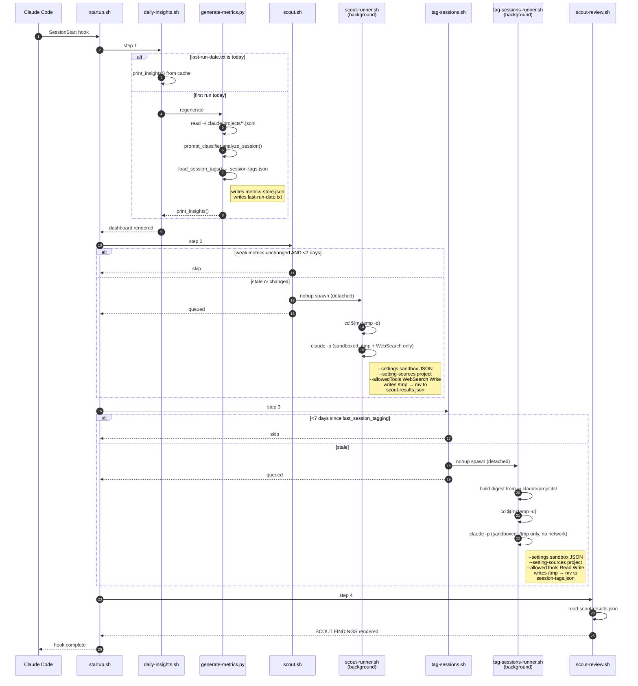
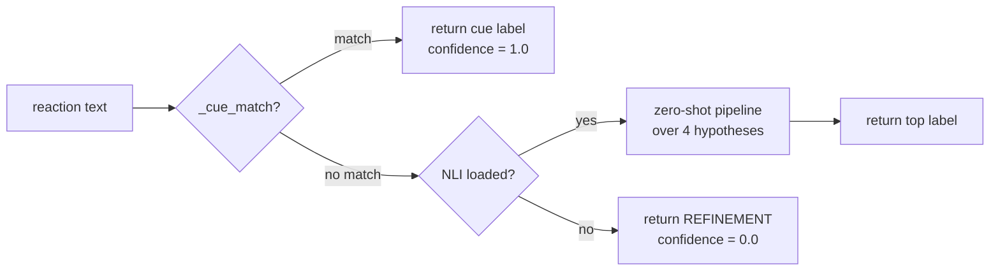

# Retro Daily internals

How the SessionStart hook orchestrates work, what state files it writes,
and the security model for the background workers.

For installation, dependencies, and uninstall, see the
[top-level README](../README.md). For symptoms and fixes, see
[troubleshooting.md](troubleshooting.md).

## How it works

Every new Claude Code session fires the `SessionStart` hook, which calls `startup.sh`. That script runs four steps sequentially; two of them (`scout`, `tag-sessions`) spawn detached `claude -p` background workers and return immediately, so the rest of the dashboard renders without waiting on network or LLM calls.

The prompt classifier inside `generate-metrics.py` (call site at `analyze_session`) routes each reaction through a hybrid path. Lexical cues handle ~98% of the synthetic eval cases for free; NLI is a fallback for unusual phrasings, and is itself optional — if `transformers` isn't installed, unmatched reactions default to `REFINEMENT`.

## State files under `$RETRO_DAILY_DATA/`

`$RETRO_DAILY_DATA` defaults to `${CLAUDE_PLUGIN_DATA}` (`~/.claude/plugins/data/retro-daily-retro-daily/`).

| File | Writer | Cadence | Purpose |
|---|---|---|---|
| `metrics-store.json` | `generate-metrics.py` | daily | append-only daily aggregates + cumulative roll-up |
| `last-run-date.txt` | `generate-metrics.py` | daily | gate so the expensive regen runs at most once per day |
| `scout-queries.json` | `generate-metrics.py` | per regen | weak-metric set + the 6 search queries scout-runner will execute; signal file that triggers `scout.sh` to spawn the background worker |
| `scout-results.json` | `scout-runner.sh` | ≥7 days | latest scout findings rendered by `scout-review.sh` |
| `scout-archive/YYYY-MM-DD-HHMMSS.json` | `scout-runner.sh` | ≥7 days | timestamped snapshots of prior scouts (read by `scout-browse.sh`) |
| `scout.log` | `scout-runner.sh` | per spawn | append-only worker log; `tail` this to debug stuck/failed scout runs |
| `session-tags.json` | `tag-sessions-runner.sh` | 7 days | LLM-derived `{id → topic, interaction_type}` map joined into daily metrics |
| `session-tags-archive/YYYY-MM-DD-HHMMSS.json` | `tag-sessions-runner.sh` | 7 days | timestamped snapshots of prior tag runs |
| `tag-sessions.log` | `tag-sessions-runner.sh` | per spawn | append-only worker log for the weekly tagger |
| `analysis-history.json` | both runners | per run | last-run dates + last weak-metric set; gates the two runners |
| `.scout.lock` / `.tag-sessions.lock` | runners | transient | PID files preventing double-spawn |
| `.venv/` | `setup-venv.sh` | install / update | isolated Python env for `sentence-transformers` and optional NLI |

**Cadence implication.** Tag results lag by up to 7 days. A session created today won't have a topic in the dashboard until the next weekly tagging run — it'll show up under `topics: untagged` in `metrics-store.json` and the corresponding dashboard line. Force an immediate run with `TAG_FORCE=1 bash tag-sessions.sh` if you want to backfill.

## Security model for background workers

Both `scout-runner.sh` and `tag-sessions-runner.sh` spawn `claude -p` to do real work (WebSearch / Read+Write to `/tmp`). Without intervention, third-party `PreToolUse` hooks installed at the user level — like [Sage](https://github.com/gendigitalinc/sage) — return `"ask"` against any unattended session and kill `claude -p` with `terminal_reason=hook_stopped` before any work happens.

Rather than bypass those hooks with `--dangerously-skip-permissions` (which would silently disable the user's chosen security tooling), the runners wrap each `claude -p` invocation in Claude Code's **OS-level sandbox** (`sandbox-exec` on macOS, `bubblewrap` on Linux). The sandbox config passed via `--settings`:

| Worker | Filesystem writes | Network |
|---|---|---|
| `scout-runner.sh` | `/tmp` only (denies `/Users`, `/etc`, `/usr`, `/var`, `/Library`, `/Applications`) | all domains allowed (WebSearch needs internet) |
| `tag-sessions-runner.sh` | `/tmp` only (same denylist) | all domains denied |

`failIfUnavailable: true` means if the OS sandbox can't be set up, the worker fails loudly rather than silently running unsandboxed. On supported systems, this is meaningfully safer than the alternative — even if a prompt-injected response tries to write to `~/.ssh/authorized_keys` or curl-pipe a shell, the kernel refuses.

**Why this works alongside Sage.** The sandbox is enforced by the OS at the syscall level, before any hook fires. Once `claude -p` is wrapped, Sage's `PreToolUse` either doesn't run (sandboxed sessions are exempt in some configurations) or runs but its verdict is moot — the sandbox is already the safety floor. Empirically, sandboxed scout runs complete cleanly with `terminal_reason=completed` and no hook interference.

**Opt out entirely.** If you'd rather not have retro-daily spawn unattended Claude sessions at all — even sandboxed — set `RETRO_DAILY_NO_BACKGROUND_WORKERS=1` in your environment. The dashboard still renders (totals, competency, efficiency, contributions heatmap, focus areas); only scout findings and session tags are skipped. You'll see `[scout] skipped — RETRO_DAILY_NO_BACKGROUND_WORKERS=1` in the hook output instead.
